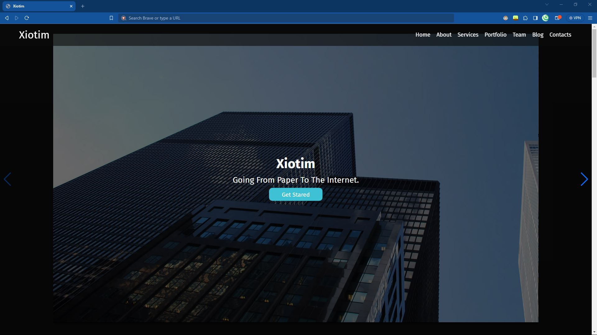
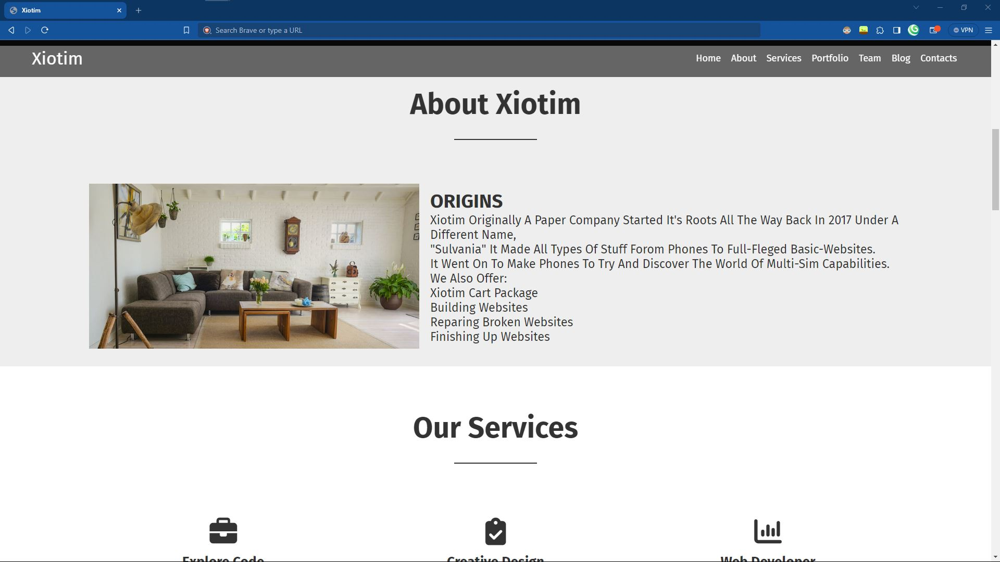
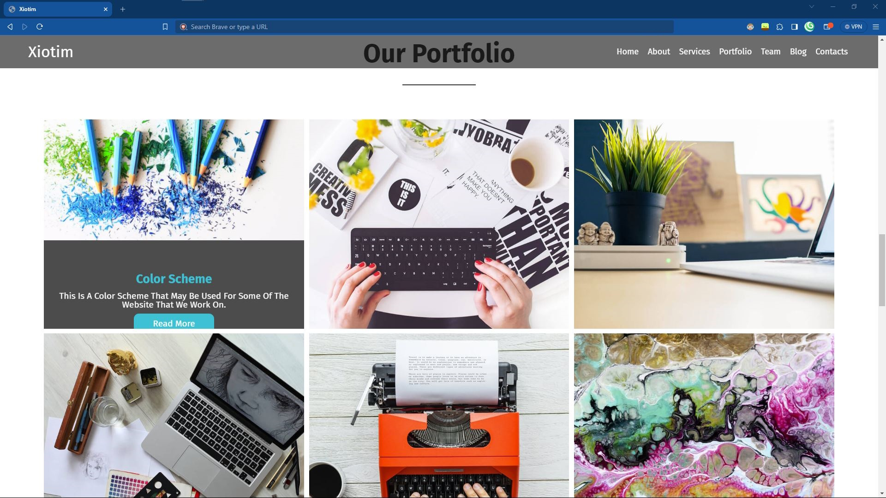
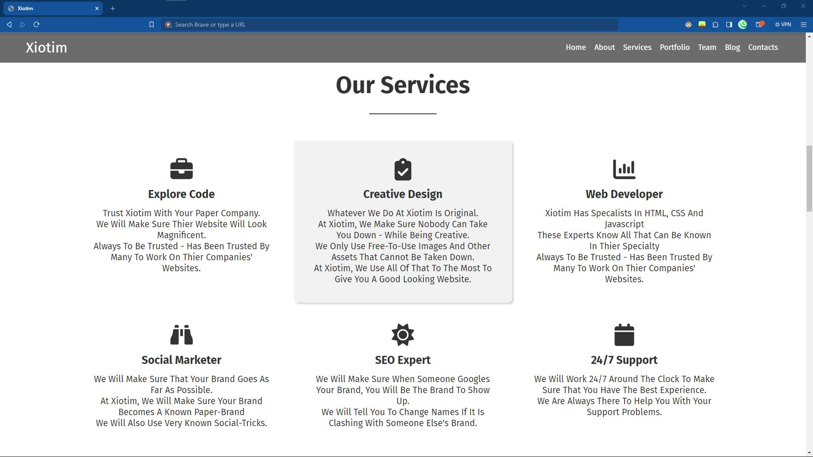
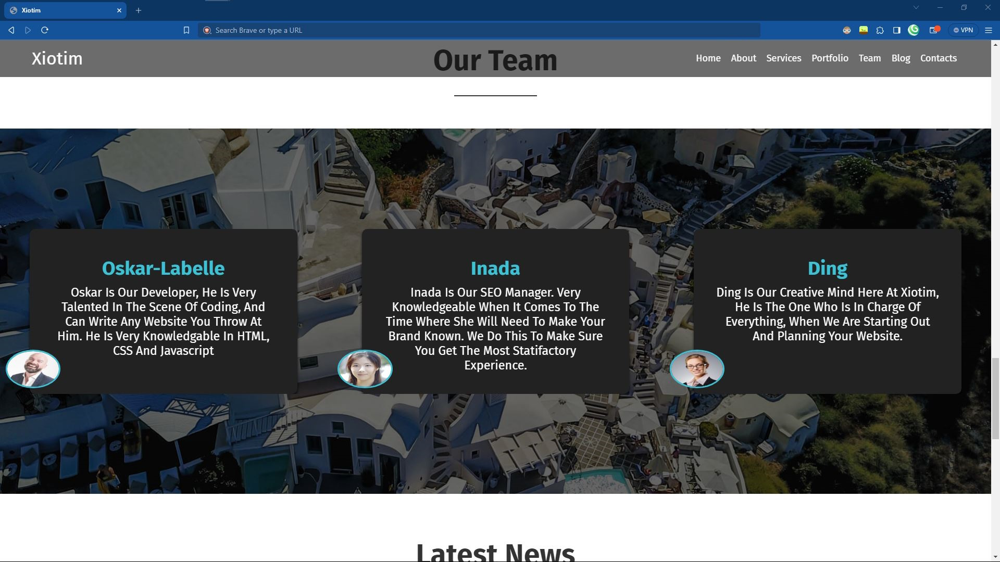
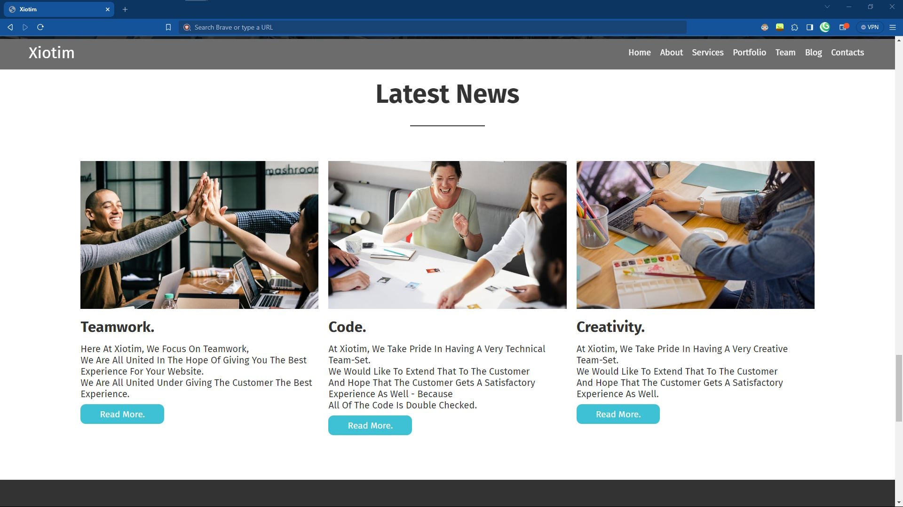
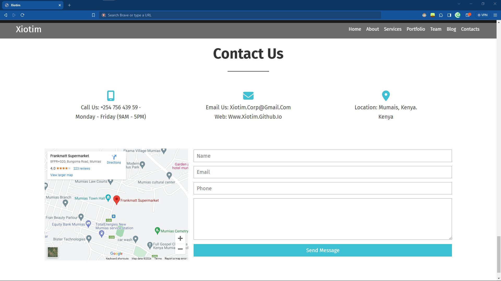

# Xiotim :: Website

This is the GitHub Repository for the Xiotim Website. This basically just for the web - it is a working demo not that far off - haven't replaced it with my one pictures but I coded it by hand.

**(thanks codeN!)**


## Acknowledgements

 - Code origanlly written by [codeN](https://www.youtube.com/@Code-N) (on YouTube)
 - Re-Generated Names :: [Name Generator ](https://www.behindthename.com/random/random.php?gender=both&number=2&sets=1&surname=&randomsurname=yes&all=yes) (still has my settings..)
 -  Shoutout: [Xiotim-Studium Tools](https://xio-tim.github.io/studium)

    
## Authors

- [Xiotim Corp.](https://www.github.com/xio-tim)


- [Avun](https://www.github.com/avun-ai)


## Demo

This doesn't contain a demo but can be found on the web as this adress listed [here](https://xio-tim.github.io/xiotim). Please try to refrain from forking this GitHub Repo. (or don't, I don't care.)


## Features

- Portfolio of Company

- Home of Company

- Uses SwiperJS

- Works with Mobile!

- Has a  NavBar **(nss)**
## Screenshots

Here, I will attach about 7 screenshots - basically giving you the whole website without
need to view, but it is okay. 









All Done in HTML, CSS and under 50 lines of JavaScript.


## Run Locally

Clone the project and run it on XAMPP (PS: I would recommend having a locally hosted domain for this step. ~ makes it more satisfying...)

```bash
  git clone https://github.com/xio-tim/xiotim
```

Go to the project directory

```bash
  cd xiotim
```

Install XAMPP (via choclatey)

```bash
  choclatey install xampp
```

Start the server with a command

```bash
  [Directory]/[ServerName]/apache-start.bat
```


## Roadmap

- Not really much, just implemented Portfolio

- Browser support for the Big Three (Chrome, Firefox, (Edge & Safari) - Gecko)

- Written by Hand

- Written full in the main three front-end languages. HTML, CSS & Javascript.

- Student Graduation cap as FavIcon.


## Support

For support, [email us](mailto:trowesigames@gmail.com) or join our Discord Group (it may not be up right now.)


## Feedback

This also is the same for Feedback - wheter it is positive, or negative - you can give us constructive critism. No hate - please. Otherwise, we encourage you to [email us](mailto:trowesigames@gmail.com).


## FAQ

#### Is there anything I can send for you to add?

Yeah! But for now we may be closed - because this is the Xiotim website - but later on when we actually get our own website we will just continue adding on this to make it the ultimate template for starters. 

PS: The contact part doesn't work just placeholder.

#### Can I host this?

Definately! I am not really sure for WAMP as last time because most of the experience I have with it is negative (NGL!). So I recommend XAMPP because about ~6 years of using it and no complains. As usual I reccomend a [tutorial](https://www.youtube.com/watch?v=LzucEZh4_no).

## Used By

This project is used by the following companies:

- Studium

- noHesi

- Xiotim


## Installation

Please, I insist Install XAMPP.. If you want anymore instructions look at the tutorial in the FAQ or please refer to Run Locally.. please, please, please.

```bash
  choclatey install xampp
```
    
## Tech Stack

**Client:** HTML, CSS, SwiperJS

**Server:** JavaScript (partially)


## Documentation

- I cannot tell about all of the documentation, so please refer to:

- [codeN](https://youtube.com/watch?v=0jFjZBwwvsY)'s tutorial.


## API Reference

This doesn't use any APIs it only uses Frameworks - so it doesn't need any APIs, very surface-level project, If it needs any more I will make sure to be telling you in the read-mes.

